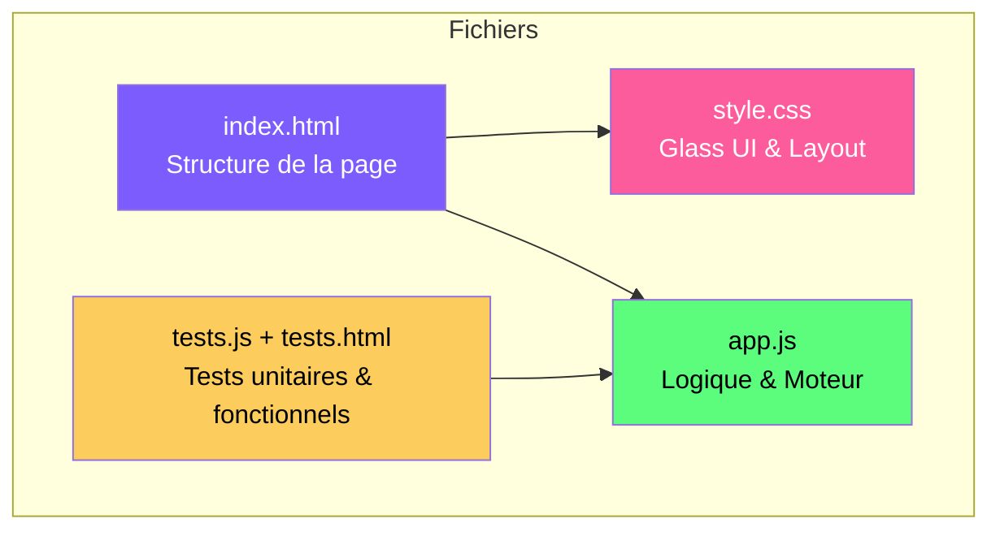
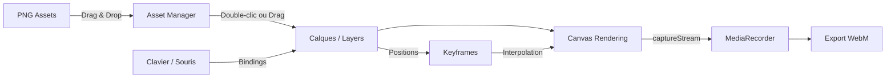
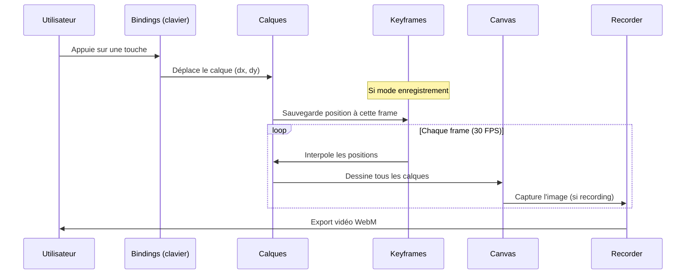
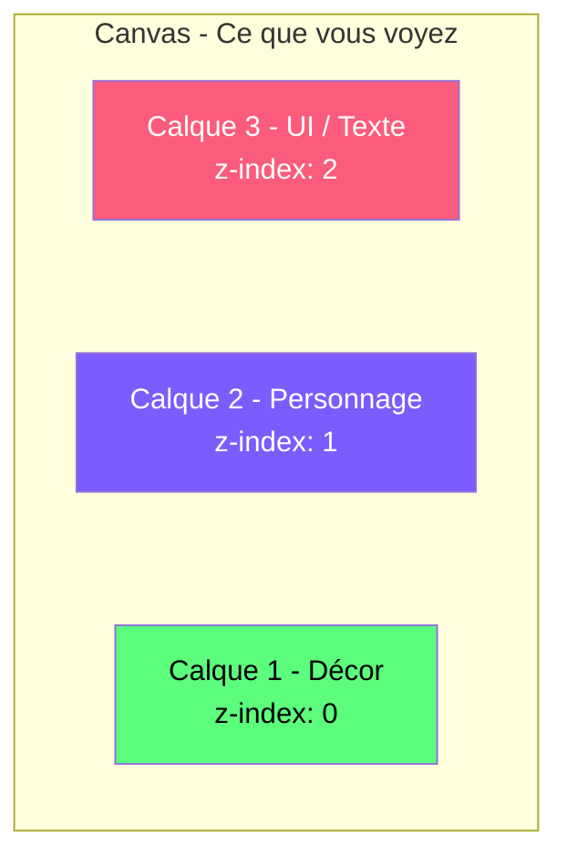
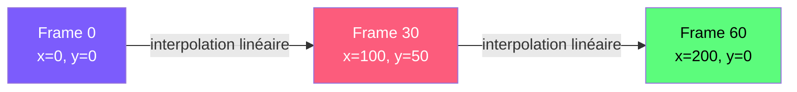
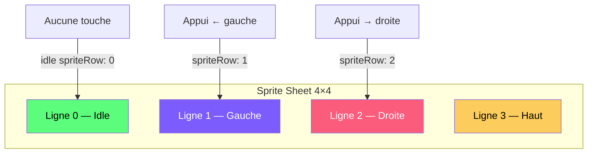
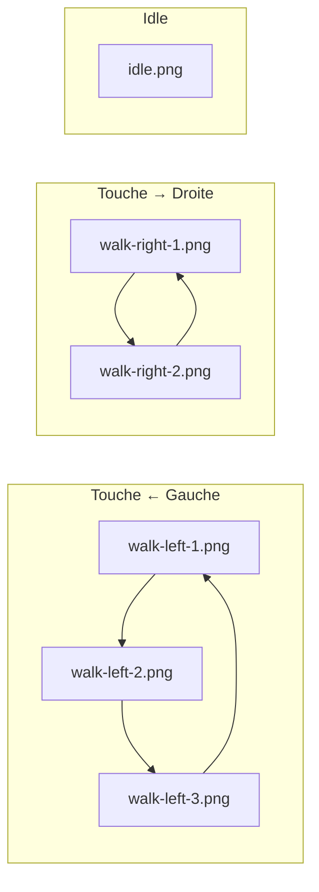
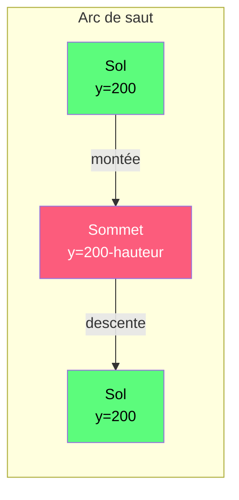
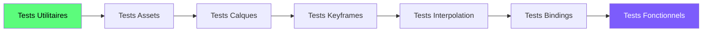

# Pixel Art Animator

Outil web pour animer vos créations pixel art ! Chargez vos PNG, configurez des contrôles clavier/souris, enregistrez vos animations.

## Démarrage rapide

1. Ouvrir `index.html` dans un navigateur (Chrome/Firefox/Edge)
2. Glisser-déposer vos images PNG dans la zone "Assets"
3. Double-cliquer sur un asset pour créer un calque
4. Configurer les bindings clavier dans le panneau de droite
5. Appuyer sur **Play** (ou Espace) pour animer !

## Architecture de l'application



## Flux de données



## Comment ça marche : le moteur d'animation



## Concepts clés

### Calques (Layers)



Chaque calque a :
- **Position** (x, y) — où il est sur le canvas
- **Échelle** (scaleX, scaleY) — taille relative
- **Opacité** — transparence (0 = invisible, 1 = opaque)
- **Visibilité** — on/off
- **Bindings** — touches clavier pour le déplacer
- **Sprite sheet** — pour les animations image par image

### Keyframes et interpolation



Les keyframes sont des "points de passage". L'outil calcule automatiquement les positions intermédiaires.

**Exemple :** Si à la frame 0 votre perso est à x=0, et à la frame 30 il est à x=100, alors à la frame 15 il sera automatiquement à x=50.

### Sprite Sheets

Si votre asset est un sprite sheet (plusieurs frames d'animation sur une seule image) :

```
┌────┬────┬────┬────┐
│ F1 │ F2 │ F3 │ F4 │  ← 4 frames, 1 ligne, 4 colonnes
└────┴────┴────┴────┘

Configurer :
- Largeur frame : largeur d'une cellule (px)
- Hauteur frame : hauteur d'une cellule (px)
- Nb frames : nombre total d'images
- Colonnes : nombre de colonnes
- Vitesse : frames par seconde de l'animation du sprite
```

## Bindings (contrôles)

Pour chaque calque, vous pouvez assigner des touches :

| Direction | Action | Par défaut |
|-----------|--------|------------|
| Haut ↑    | Déplace le calque vers le haut | Non configuré |
| Bas ↓     | Déplace le calque vers le bas | Non configuré |
| Gauche ← | Déplace le calque vers la gauche | Non configuré |
| Droite → | Déplace le calque vers la droite | Non configuré |
| Idle 😴   | Quand aucune touche n'est pressée | — |

**Pour configurer :** Cliquez sur le champ de touche, puis appuyez sur la touche souhaitée.

La **vitesse** (en pixels par frame) est configurable pour chaque direction.

### Animation directionnelle

Chaque direction (+ idle) peut aussi changer l'image affichée. Deux modes :

#### Mode 1 : Sprite Sheet par direction (recommandé pour les sprite sheets)



Configurez le numéro de **ligne (Sprite row)** pour chaque direction. L'animation cycle automatiquement entre les colonnes de cette ligne.

#### Mode 2 : Images séparées par direction



Ajoutez des images à chaque direction via le menu déroulant. L'outil cycle automatiquement entre elles quand la touche est maintenue. Quand la touche est relâchée, il revient à l'image idle.

### Saut

Chaque calque peut être configuré pour sauter avec un arc parabolique :



| Paramètre | Description | Défaut |
|-----------|-------------|--------|
| Touche | Touche pour déclencher le saut | Non configuré |
| Hauteur | Hauteur max du saut en pixels | 80 px |
| Durée | Durée totale du saut en secondes | 0.5 s |
| Drift H | Déplacement horizontal pendant le saut (px/frame) | 0 |

- Le saut suit une courbe **sin(π·t)** : montée douce, sommet, descente douce
- **Pas de double saut** : il faut attendre l'atterrissage
- On peut se déplacer horizontalement pendant le saut (drift)
- On peut assigner un **sprite row** ou des **images** spécifiques pour l'animation de saut

## Modes

### Mode Lecture (par défaut)
Les keyframes sont lus et les calques bougent automatiquement selon l'animation enregistrée.

### Mode Enregistrement
Chaque mouvement (clavier ou souris) crée automatiquement un keyframe. C'est comme ça que vous "dessinez" votre animation.

**Workflow typique :**
1. Activer le mode enregistrement
2. Appuyer sur Play
3. Utiliser les touches pour bouger vos calques
4. Les mouvements sont enregistrés en keyframes
5. Désactiver le mode enregistrement
6. Relancer en mode lecture pour voir le résultat
7. Enregistrer en WebM avec le bouton Rec

## Export

Le bouton **Rec** enregistre tout ce qui se passe sur le canvas en vidéo **WebM**. L'enregistrement démarre automatiquement la lecture et s'arrête à la fin de la timeline.

## Tests

Ouvrir `tests.html` dans un navigateur pour exécuter la suite de tests unitaires et fonctionnels.


